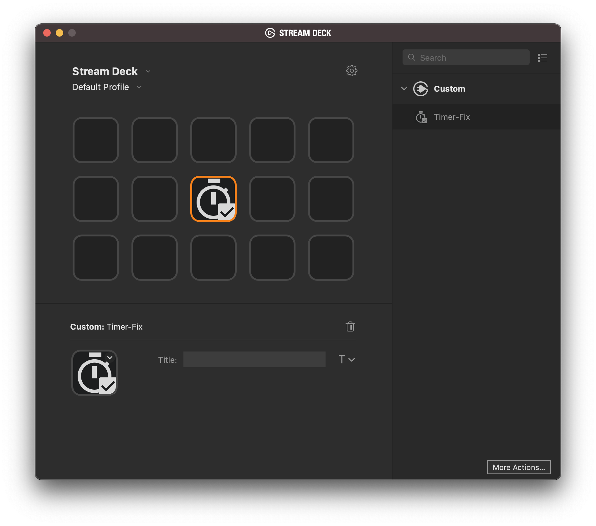
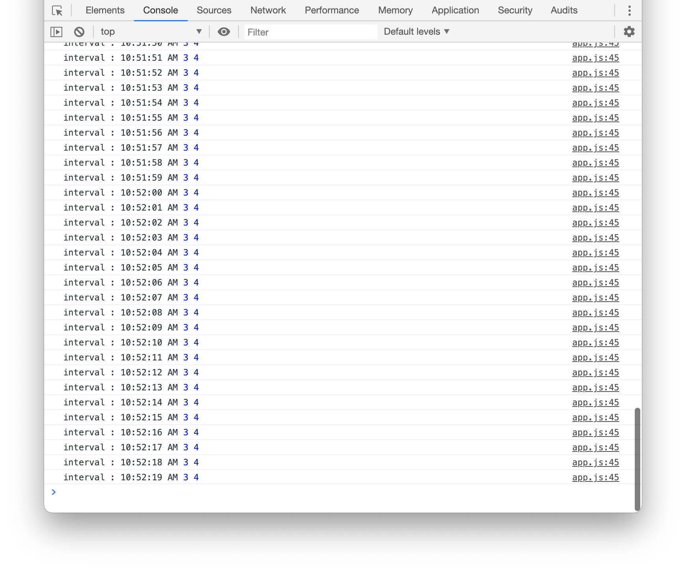

> [!IMPORTANT]  
> The new [Stream Deck SDK](https://github.com/elgatosf/streamdeck) is now available!
>
> This repository has been marked as deprecated, and will soon be deleted. If you have any questions, please contact us via [maker@elgato.com](maker@elgato.com), or join our [Makertplace Makers](https://discord.gg/GehBUcu627) Discord community.

This Stream Deck plugin demonstrates how to have a reliable Javascript timer in a Stream Deck plugin using the Stream Deck SDK.

# Features

- Code written in Javascript
- Cross-platform (macOS, Windows)

# Installation

Double-click on the file `com.streamdeck.timerfix.streamDeckPlugin` to install the plugin in Stream Deck.

# Source code

The folder `com.streamdeck.timerfix.sdPlugin` contains the source code of the plugin. You can use the file `js/timers.js` as a drop-in replacement for the Javascript timers.

You can debug the Javascript plugin using Google Chrome's web developer tools. In order to do so, you first need to enable the HTML remote debugger in Stream Deck:

- on macOS, you will need to run the following command line in the Terminal:
   `defaults write com.elgato.StreamDeck html_remote_debugging_enabled -bool YES`
- on Windows, you will need to add a `DWORD html_remote_debugging_enabled with value 1` in the registry `@ HKEY_CURRENT_USER\Software\Elgato Systems GmbH\StreamDeck`.

After you relaunch the Stream Deck app, you can open [http://localhost:23654/](http://localhost:23654/) in Chrome, where you will find a list of `Inspectable pages` (plugins):

